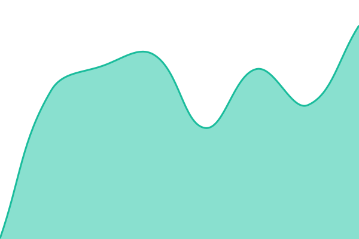
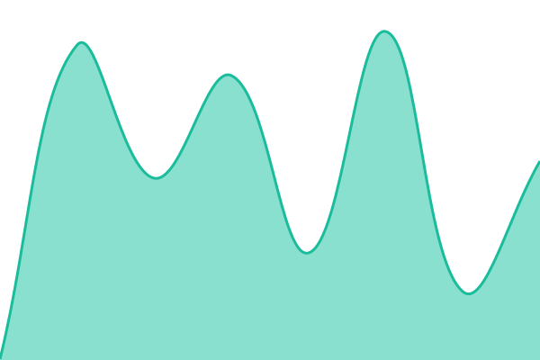

# [📈 Live Status](https://SolarNetworkFoundation.github.io/upptime): <!--live status--> **🟩 All systems operational**

This repository contains the open-source uptime monitor and status page for [SolarNetwork Foundation](https://solarnetwork.org.nz/), powered by [Upptime](https://github.com/upptime/upptime).

We use [Issues](https://github.com/SolarNetworkFoundation/upptime/issues) as incident reports, [Actions](https://github.com/SolarNetworkFoundation/upptime/actions) as uptime monitors, and [Pages](https://SolarNetworkFoundation.github.io/upptime) for the status page.

<!--start: status pages-->
<!-- This summary is generated by Upptime (https://github.com/upptime/upptime) -->
<!-- Do not edit this manually, your changes will be overwritten -->
<!-- prettier-ignore -->
| URL | Status | History | Response Time | Uptime |
| --- | ------ | ------- | ------------- | ------ |
|  SolarIn | 🟩 Up | [solar-in.yml](https://github.com/SolarNetworkFoundation/upptime/commits/HEAD/history/solar-in.yml) | 

 406ms
     
 | 

<a href="https://SolarNetworkFoundation.github.io/upptime/history/solar-in">100.00%</a>
    

|  SolarOcpp | 🟩 Up | [solar-ocpp.yml](https://github.com/SolarNetworkFoundation/upptime/commits/HEAD/history/solar-ocpp.yml) | 

 234ms
     
 | 

<a href="https://SolarNetworkFoundation.github.io/upptime/history/solar-ocpp">100.00%</a>
    

|  SolarOscp | 🟩 Up | [solar-oscp.yml](https://github.com/SolarNetworkFoundation/upptime/commits/HEAD/history/solar-oscp.yml) | 

 355ms
     
 | 

<a href="https://SolarNetworkFoundation.github.io/upptime/history/solar-oscp">100.00%</a>
    

|  SolarQuery | 🟩 Up | [solar-query.yml](https://github.com/SolarNetworkFoundation/upptime/commits/HEAD/history/solar-query.yml) | 

 351ms
     
 | 

<a href="https://SolarNetworkFoundation.github.io/upptime/history/solar-query">100.00%</a>
    

|  SolarUser | 🟩 Up | [solar-user.yml](https://github.com/SolarNetworkFoundation/upptime/commits/HEAD/history/solar-user.yml) | 

 244ms
     
 | 

<a href="https://SolarNetworkFoundation.github.io/upptime/history/solar-user">100.00%</a>
    

<!--end: status pages-->

[**Visit our status website →**](https://SolarNetworkFoundation.github.io/upptime)

## 📄 License

- Powered by: [Upptime](https://github.com/upptime/upptime)
- Code: [MIT](./LICENSE) © [SolarNetwork Foundation](https://solarnetwork.org.nz/)
- Data in the `./history` directory: [Open Database License](https://opendatacommons.org/licenses/odbl/1-0/)
